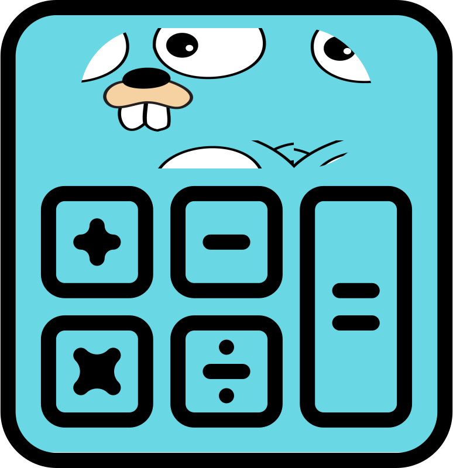

# Goculator CLI



Goculator CLI is a command-line calculator built with Cobra, written in Go.
It supports basic operations like sum, subtraction, multiplication, and division using integers.

## 📦 Installation

```sh
go install github.com/luissena/goculator-cli@latest
```

Or clone and build manually:

```sh
git clone https://github.com/luissena/goculator-cli.git
cd goculator-cli
go build -o goculator-cli
```

## 🚀 Usage

```sh
goculator-cli [command] [numbers...]
```

### Available Commands

sum – Adds all numbers

subtract – Subtracts numbers from left to right

multiply – Multiplies all numbers

divide – Divides numbers from left to right

### Examples

```sh
goculator-cli sum 1 2 3
# Result: 6

goculator-cli subtract 10 2 3
# Result: 5

goculator-cli multiply 2 3 4
# Result: 24

goculator-cli divide 20 2 2
# Result: 5
```

## ⚠️ Error Handling

- All arguments must be valid integers.
- Division by zero is not allowed.
- Invalid input or missing arguments will return an appropriate error message.

### Error Examples

```sh
  goculator-cli sum 2 a
# Error: invalid argument "a", expected integer

goculator-cli divide 4 0
# Error: cannot divide by zero
```

## Shell Autocompletion

goculator-cli supports autocompletion scripts for sh, zsh, fish, and powershell.

You can generate the completion script using:

```sh
goculator-cli completion [sh|zsh|fish|powershell]
```

### Example: Enable completion for Fish

```sh
goculator-cli completion fish > ~/.config/fish/completions/goculator-cli.fish
```

For other shells, follow Cobra’s standard completion setup or refer to your shell's documentation.

## 📁 Project Structure

```plaintext
.
├── cmd
│   ├── root.go
│   ├── sum.go
│   ├── subtract.go
│   ├── multiply.go
│   └── divide.go
└── assets
│   └── logo.svg
├── main.go
├──  go.mod
└── go.sum


```

## 📚 Requirements

- Go 1.20 or newer
- Cobra CLI library

## 📄 License

Licensed under the MIT License.
